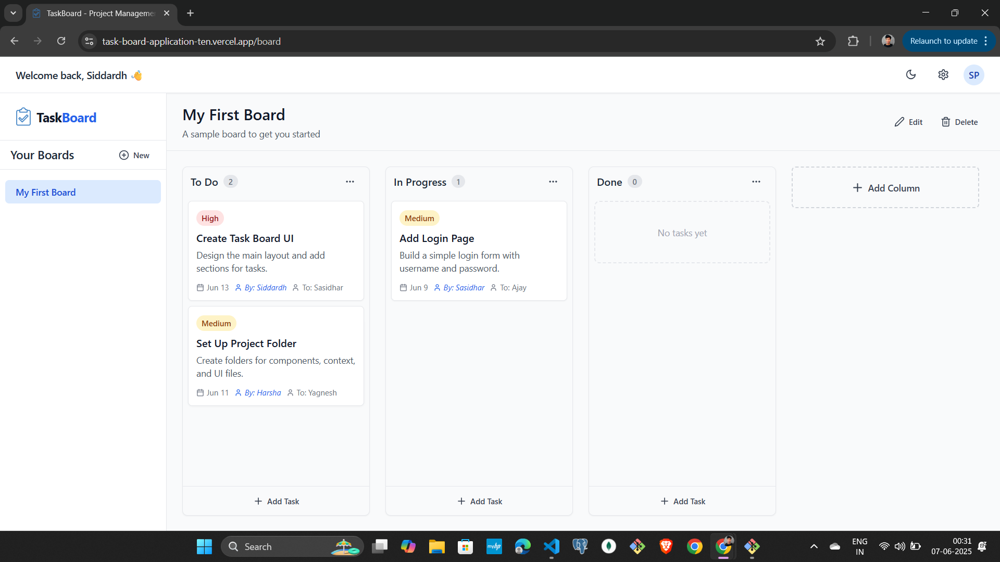

# 🧩 TaskBoard - Task Management Tool

**TaskBoard** is a clean, intuitive, and responsive task management application that helps you organize your projects using boards, columns, and tasks — inspired by the Kanban methodology.



---

## 🚀 Features

- 📋 **Create Boards** for different teams or projects
- 🧱 **Add Columns** like "To Do", "In Progress", "Done"
- ✅ **Manage Tasks** with title, description, priority, and assignee
- 🔁 **Drag and Drop** support for reordering columns and tasks
- 👥 **Collaborate** with team members visually
- 💻 Fully responsive and easy to use

---

## 🛠️ Tech Stack

| Tech         | Usage                      |
|--------------|----------------------------|
| React        | Frontend UI                |
| TypeScript   | Type safety and interfaces |
| Vite         | Fast build tool            |
| Tailwind CSS | Styling and layout         |
| React Router | Page routing               |
| React DnD / Beautiful DnD | Drag-and-drop interactions |

---


## 📁 Project Structure

```bash
taskboard-application/
├── src/
│   ├── assets/ 
│   │   ├── logo.png
│   ├── components/
│   │   ├── Board/
│   │   ├── Column/
│   │   ├── Layout/
│   │   ├── Task/
│   │   └── UI/
│   ├── context/
│   ├── pages/
│   ├── types/
│   ├── App.tsx
│   ├── index.css
│   └── main.tsx
├── index.html
├── package.json
├── tailwind.config.js
└── vite.config.ts
```

---

## 📦 Installation & Setup

```bash
# 1. Clone the repository
git clone https://github.com/siddardhPol3000/Task-Board-Application.git
cd taskboard-application

# 2. Install dependencies
npm install

# 3. Run the development server
npm run dev
```

The app will be available at `http://localhost:5173`.

## 🌐 Live Demo
- Check out the deployed application here 👉 [TaskBoard Live](https://task-board-application-ten.vercel.app/)

---

## 🚀 Future Enhancements

- ✅ Visually reorder tasks within columns using drag-and-drop for an intuitive workflow.
- 📝 Enhance task details with headings, checklists, links, and rich formatting.
- 🔍 Filter tasks by priority, due date, or assignee. Sort boards/tasks to quickly find what matters most.
- 🔎 Enable global or scoped search to find boards or tasks by title, content, or tags.
- ⚡ Use WebSockets to instantly reflect changes across team members’ sessions in real time.
- 🔐 Add login/signup, protected routes, and session management using JWT or OAuth.
- 🗂️ Use Node.js, Express, and a database like MongoDB or PostgreSQL to persist data and support user accounts.

---

## 🔗 Connect With Me

🧑‍💻 [LinkedIn](https://www.linkedin.com/in/siddardhpol/)  
💻 [GitHub](https://github.com/siddardhPol3000)
